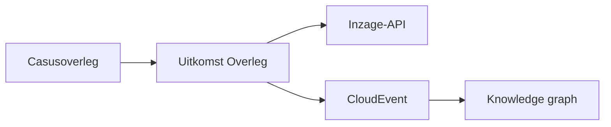

# Uitwisselen Uitkomst Overleg

> Status: Concept  
> Versie: 1.0-draft

## 1. Inleiding

Deze specificatie beschrijft de samenwerkfunctie **Uitwisselen Uitkomst Overleg**.

De samenwerkfunctie ondersteunt het beschikbaar stellen en raadplegen van de uitkomst van een casusoverleg tussen ketenpartners.

De oplossing bestaat uit twee complementaire onderdelen:

1. De inzage-API waarmee de inhoud van de Uitkomst Overleg beschikbaar wordt gesteld.
2. CloudEvents waarmee gebeurtenissen rondom de Uitkomst Overleg worden gemeld.

De CloudEvents bevatten niet de volledige inhoud van de uitkomst. Zij bevatten informatie die nodig is voor notificatie, provenance, auditing en het opbouwen van een knowledge graph.

## 2. Scope

Deze specificatie beschrijft:

- de CloudEvents binnen deze samenwerkfunctie;
- het gebruik van PROV-JSONLD;
- het graphmodel;
- de mapping tussen het informatiemodel en de graph;
- de events:
  - `uitwisselen-uitkomst-overleg.uitkomst-beschikbaar-gesteld`;
  - `uitwisselen-uitkomst-overleg.uitkomst-ingezien`.

Deze specificatie beschrijft niet de inhoudelijke modellering van besluiten en acties of de interne totstandkoming daarvan.

## 3. Architectuur



De inzage-API is de bron voor de inhoudelijke gegevens.

De graph ondersteunt:

- provenance;
- auditing;
- zoeken naar eerdere betrokkenheid van personen.

## 4. CloudEvents

Binnen deze samenwerkfunctie worden twee eventtypen gebruikt:

| Eventtype | Betekenis |
|---|---|
| `uitwisselen-uitkomst-overleg.uitkomst-beschikbaar-gesteld` | De Uitkomst Overleg is beschikbaar gesteld. |
| `uitwisselen-uitkomst-overleg.uitkomst-ingezien` | De Uitkomst Overleg is geraadpleegd. |

## 5. Gebruik van PROV-JSONLD

Het attribuut `data` van het CloudEvent bevat een PROV-JSONLD-graaf.

De graaf beschrijft de provenance van de beschikbaarstelling of inzage.

De graaf beschrijft niet de inhoudelijke besluitvorming van het casusoverleg.

## 6. Conceptueel graphmodel

| Concept | PROV-type | Betekenis |
|---|---|---|
| UitkomstOverleg | Entity | De via de API beschikbare resource. |
| Betrokkene | Entity | Zoekanker voor personen. |
| BeschikbaarStellenUitkomst | Activity | Activiteit waarmee de uitkomst beschikbaar wordt gesteld. |
| InzienUitkomst | Activity | Activiteit waarmee de uitkomst wordt geraadpleegd. |
| Organisatie | Agent | Organisatie die een activiteit uitvoert. |

Relaties:

```text
UitkomstOverleg
    BETREFT
Betrokkene

UitkomstOverleg
    WAS_GENERATED_BY
BeschikbaarStellenUitkomst

BeschikbaarStellenUitkomst
    WAS_ASSOCIATED_WITH
Organisatie

InzienUitkomst
    USED
UitkomstOverleg

InzienUitkomst
    WAS_ASSOCIATED_WITH
Organisatie
```

## 7. Betrokkene

De Betrokkene wordt als afzonderlijke Entity opgenomen.

De reden hiervoor is dat de graph bevraagbaar moet zijn op basis van het burgerservicenummer, bijvoorbeeld tijdens een ZSM-overleg.

De Betrokkene vormt geen onderdeel van de provenance, maar is een domeinanker binnen de graph.

Een toekomstige uitbreiding kan ondersteuning voor het vreemdelingennummer toevoegen.

## 8. Ontwerpkeuzes

Belangrijke uitgangspunten:

- De inhoud van de Uitkomst Overleg blijft beschikbaar via de inzage-API.
- CloudEvents bevatten geen duplicatie van besluiten en acties.
- Provenance wordt vastgelegd met PROV-JSONLD.
- Betrokkene wordt opgenomen om operationeel zoeken mogelijk te maken.
- Activities krijgen geen businessidentiteit.

